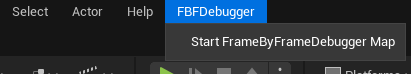

<h1 style="text-align:center;">Blueprint</h1>

[CPP](readme.md)

# What is this?

This plugin lets you "record" frames, storing user-defined data for each frame and replaying it later. 

By capturing unexpected behavior, you can step through it frame by frame to pinpoint exactly when and why it occurs. This simplifies debugging in scenarios where breakpoints or logging alone aren't sufficient.

> TEMP ^

# Why would I want this?
This plugin is designed to help debug problems where traditional breakpoints or logging methods are insufficient. Often, pausing the application with a breakpoint disrupts the test case, and logging every relevant value becomes too messy.

For example if the player throws a grenade but you notice that after a bit, the trajectory seems off. Debugging this can be challenging since setting breakpoints is impractical without knowing exactly when the issue occurs. 

Although logging velocity and other relevant data each frame is an option, it often results in an overwhelming amount of convoluted data to sift through. 

With this plugin you can easily record the velocity and any other relevant data and replay it later frame by frame to see exactly when and how it goes wrong.

# How to use
This plugin has two main components: the root frame and the actor frame.

1. **Root Frame**
   - Stores any global variables that you want to track, such as DeltaTime.
   
2. **Actor Frame**
   - Stores variables specific to individual actors. By creating an actor frame, the actor is rendered in the debug scene. You can then select the actor to view its properties at any time.

## 1. Create Root Frame

1. **Create a Blueprint**
    - Inherit from `UFBFData`.

2. **Define Variables**
    - Create variables for the data you want to save.

    **Supported Types:**
    - `FString`
    - `int`
    - `float`
    - `bool`
    - `FVector`
    - `FLinearColor`
    - `UFBFDrawableArrow`
    - `UFBFDrawableBox`
    - `UFBFDrawableSphere`
    - `UFBFDrawableSpline`

3. **(Optional) Create the Actors Array**
    - Create an array of `UFBFData` called `Actors`
    - **Note:** The Actors array is automatically filled with actors in the scene that has a FBFDebugComponent. You do not fill it manually.

4. ## Create a FBFDebugComponent
    - Create a component inheriting from FBFDebugComponent

5. **Override IsRoot()**
    - Return `true`.

6. **Override GetDebugFrame()**
    - Create an instance of your class.
    - Assign its properties and return it.

        

7. **Add the component to a singleton**
    - Choose any singleton (e.g., GameMode, PlayerController, etc.)
    - Add your component.

      
## 2. (Optional) Create Actor Frame

1. **Create a Blueprint**
    - Inherit from `UFBFData`.

2. **Define Variables**
    - Create variables for the data you want to save.

    **Required Properties**
    1. `Position` (FVector)
    2. `Name` (FString) 

    **Optional Properties**
    1. `Extents` (FVector) 
        - If not set, the actor will spawn with a scale of (1,1,1).
    2. `Scale` (FVector)
        - Can be used instead of `Extents` in simpler cases.
    3. `MeshPath` (FString) 
        - If not set, a generic cylinder will spawn.
    4. `Rotation` (FVector)
        - If not set, the actor will spawn with zeroed rotation.

4. ## Create a FBFDebugComponent
    - Create a component inheriting from FBFDebugComponent

5. **Override GetDebugFrame()**
    - Create an instance of your class.
    - Assign its properties and return it.

3. **Add your component to the actor you want to track**

## 3. (Optional) Navmesh
1. Add a NavMeshBoundsVolume to the scene
2. Set `Runtime Generation` to `true` (This is set on the `RecastNavmesh`)
3. The Navmesh will now be automatically saved and displayed in the debug scene

> Navmesh can't be saved if the plugin path has a whitespace in it.

> Not available in packaged build

## 4. Record & Play

1. **Start the Game**

2. **Start Recording**
   - Use the console command `FBF.StartRecord` to start recording.
   - Alternatively, set `bRecordOnStartup` to `true` in your project settings to start recording automatically when you enter PIE.

3. **Record Your Gameplay**

4. **Stop Recording**
   - Use the console command `FBF.StopRecord` to stop the recording.
   - You can also stop the recording by exiting PIE mode.

5. **Watch the Replay!**
   - Start the replay with the button in the top menu.

    

## Drawable Classes

To add debug shapes to your scene, you can use the drawable classes
- `FBFDrawableArrow`
- `FBFDrawableBox`
- `FBFDrawableSphere`
- `FBFDrawableSpline`

Add these as properties in your frame class, and they will be drawn in the scene.

To create your own drawable class, follow these steps:

1. Inherit from the `UFBFData` class.
2. Override the `CanDraw()` method and return `true`.
3. Implement the `Draw()` method to specify how the object should be drawn.

## Project settings
- **RecordOnStartUp**
    - If recording should automatically start when you enter PIE
- **NumberOfDecimalsToShow**
    - Number of decimals to show on floats in the debug view
- **CachePartialFrames**
    - Whether to cache partial or complete frames.
    - If `true`: Only cache the changes in each recorded frame. Increases CPU load.
    - If `false`: Cache entire recorded frame. Increases memory usage.