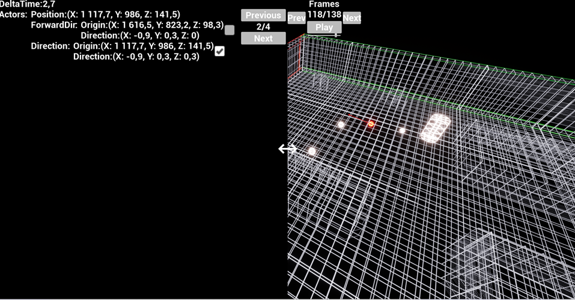
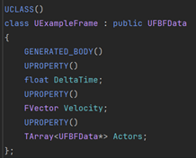
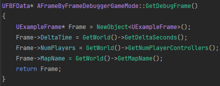

<h1 style="text-align:center;">C++</h1>

[Blueprint](Blueprint.md)

# What is this?
This plugin allows you to "record" frames, storing user defined data for each frame and replaying it later. Allowing far easier debugging in situations where breakpoints or logging isn't sufficient.

> TEMP ^

# Why would I want this?
This plugin is designed to help debug problems where traditional breakpoints or logging methods are insufficient. Often, pausing the application with a breakpoint disrupts the test case, and logging every relevant value becomes too messy.

For example if the player throws a grenade but you notice that after a bit, the trajectory seems off. Debugging this can be challenging since setting breakpoints is impractical without knowing exactly when the issue occurs. Although logging velocity and other relevant data each frame is an option, it often results in an overwhelming amount of convoluted data to sift through. With this plugin you can easily record the velocity and any other relevant data and replay it later frame by frame to see exactly when and how it goes wrong.

# How to use
This plugin has two main components: the root frame and the actor frame.

1. **Root Frame**
   - Stores global variables that you want to track, such as DeltaTime.
   
2. **Actor Frame**
   - Stores variables specific to individual actors. By creating an actor frame, the actor is rendered in the debug scene. You can then select the actor to view its properties at any time.

## Create Root Frame

1. **Create a Class**
    - Inherit from `UFBFData`.

2. **Define Properties**
    - Create properties for the data you want to save.
    - **Note:** All properties must be marked with `UPROPERTY()`.

    **Supported Types:**
    - `FString`
    - `int`
    - `float`
    - `bool`
    - `FVector`
    - `FLinearColor`
    - `UFBFDrawableArrow`
    - `UFBFDrawableBox`
    - `UFBFDrawableSphere`

3. **(Optional) Create the Actors Array**
    - Define `TArray<UFBFData*> Actors`.
    > **Note:** The Actors array is automatically filled with actors in the scene that implement the `IFBFData` interface. You do not manually populate it.

    

4. **Implement the IFBFDebugActor Interface**
    - Choose any singleton (e.g., GameMode, PlayerController, etc.)
    - Inherit from `IFBFDebugActor`.

5. **Override IsRoot()**
    - Return `true`.

6. **Override GetDebugFrame()**
    - Create an instance of your class.
    - Assign its properties and return it.
    
      

## Create Actor
1. **Create a Class Inheriting from UFBFData**
    - Define a class that inherits from `UFBFData`.

2. **Add Properties for Tracking**
    - Add the properties you want to track.

    **Required Properties**
    1. `Position` (FVector)
    2. `Name` (FString) 
        - You can use the `FBFHide` meta tag to hide this property in the debug view.

    **Optional Properties**
    1. `Extents` (FVector) 
        - If not set, the object will spawn with a default scale of (1,1,1).
    2. `MeshPath` (FString) 
        - If not set, a generic cylinder will spawn.

3. **Inherit `IFBFDebugActor` on the Actor You Want to Track**

4. **Override `GetDebugFrame()`**
    - Implement the `GetDebugFrame()` method.
    - Inside `GetDebugFrame()`, create an instance of your custom class, set its properties, and return it.

> Note: This can also be implemented with components by creating a component that inherits `IFBFDebugActor` and adding the component to the actor.
## Record & Play

1. **Start the Game in PIE**

2. **Start Recording**
   - Use the console command `FBF.StartRecord` to start recording.
   - Alternatively, set `bRecordOnStartup` to `true` in your project settings to start recording automatically when the game begins.

3. **Record Your Gameplay**

4. **Stop Recording**
   - Use the console command `FBF.StopRecord` to stop the recording.
   - You can also stop the recording by exiting PIE mode.

5. **Watch the Replay!**
   - Click on the "Debug Scene" button to view the replay of your gameplay.
   
## Drawable classes
FBFDrawableArrow, FBFDrawableBox and FBFDrawableSphere are custom classes that will be drawn out in the scene if added as a property in a frame class.
> Instances of these classes can be created with their static Create() Function.

## Navmesh
By adding a navmesh to the scene and setting 'Runtime Generation' to Dynamic the navmesh will automatically be saved and displayed in the debug scene.
> Runtime Generation is set on the RecastNavmesh.

> Navmesh can't be saved if the plugin path has a whitespace in it.
