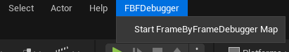

<h1 style="text-align:center;">C++</h1>

[Blueprint](Blueprint.md)

# What is this?

This plugin lets you "record" frames, storing user-defined data for each frame and replaying it later. 

By capturing unexpected behavior, you can step through it frame by frame to pinpoint exactly when and why it occurs. This simplifies debugging in scenarios where breakpoints or logging alone aren't sufficient.

> TEMP ^ 

# Why would I want this?

For example if you were trying to implement a boids system, where actors that come too close to eachother instead try to avoid eachother. But when the actors come close, they instead start to jitter. You can't place a breakpoint, because that would break the test case and logging every value would result in an overwhelming amount of convoluted data to sift through.

With this plugin you can easily record all the relevant boid forces each frame and then replay it frame by frame, letting you see exactly when and how it goes wrong.

# How to use
This plugin has two main components: the `root frame` and the `actor frame`.

1. **Root Frame**
   - Stores any global variables that you want to track, such as DeltaTime.
   
2. **Actor Frame**
   - Stores variables specific to individual actors. By creating an actor frame, the actor is rendered in the debug scene. You can then select the actor to view its properties at any time.

## Creating a Debug Frame

### Step 1: Create a Class
- **Inherit from `UFBFData`**  
  Create a class that inherits from `UFBFData`.

### Step 2: Define Properties
- **Add properties to track the data you want to save.**  
  **Note:** All properties should be marked with `UPROPERTY()`
  
  **Supported Types:**
  - `FString`
  - `int`
  - `float`
  - `bool`
  - `FVector`
  - `FLinearColor`
  - `UFBFDrawableArrow`
  - `UFBFDrawableBox`
  - `UFBFDrawableSphere`
  - `UFBFDrawableSpline`

**For Actor Frame:**
- **Required Properties:**
  1. `Position` (FVector)
  2. `Name` (FString) 
- **Optional Properties:**
  1. `Extents` (FVector) - Used for actor scale, defaults to (1,1,1) if not set.
  2. `Scale` (FVector) - Can be used instead of `Extents`.
  3. `MeshPath` (FString) - Defaults to a generic cylinder if not set.
  4. `Rotation` (FVector) - Defaults to zeroed rotation if not set.

  > Can use `FBFHide` meta tag to hide properties in the debug view.

### Step 3: Implement the `IFBFDebugActor` Interface
- **For Root Frame:**
    - Inherit from `IFBFDebugActor` on any singleton (e.g., GameMode, PlayerController, etc.)
- **For Actor Frame:**
    - Inherit from `IFBFDebugActor` on the actor you want to track.

### Step 4: Override Interface Methods
- **For Root Frame:**
  - **`IsRoot()`:** Override to return `true`.
  
- **For Both Root and Actor Frame:**
  - **`GetDebugFrame()`:** Implement this method, create an instance of your defined class, set its properties, and return the instance.

## Navmesh
1. Add a NavMeshBoundsVolume to the scene
2. Set `Runtime Generation` to `true` (This is set on the `RecastNavmesh`)
3. The Navmesh will now be automatically saved and displayed in the debug scene

> Navmesh can't be saved if the plugin path has a whitespace in it.

> Not available in packaged build

## 4. Record & Play

1. **Start the Game**

2. **Start Recording**
   - Use the console command `FBF.StartRecord` to start recording.
   - Alternatively, set `bRecordOnStartup` to `true` in your project settings to start recording automatically when you enter PIE.

3. **Record Your Gameplay**

4. **Stop Recording**
   - Use the console command `FBF.StopRecord` to stop the recording.
   - You can also stop the recording by exiting PIE mode.

5. **Watch the Replay!**
   - Start the replay with the button in the top menu.

    

## Drawable Classes

To add debug shapes to your scene, you can use the drawable classes
- `FBFDrawableArrow`
- `FBFDrawableBox`
- `FBFDrawableSphere`
- `FBFDrawableSpline`

Add these as properties in your frame class, and they will be drawn in the scene.

To create your own drawable class, follow these steps:

1. Inherit from the `UFBFData` class.
2. Override the `CanDraw()` method and return `true`.
3. Implement the `Draw()` method to specify how the object should be drawn.

## Project settings
- **RecordOnStartUp**
    - If recording should automatically start when you enter PIE
- **NumberOfDecimalsToShow**
    - Number of decimals to show on floats in the debug view
- **CachePartialFrames**
	- Whether to cache partial or complete frames.
	- If `true`: Only cache the changes in each recorded frame. Increases CPU load.
	- If `false`: Cache entire recorded frame. Increases memory usage.

1. Mention breakpoints & logging too much (Done)
2. Actor array is unclear
3. Change example
4. Move root /actor frame intro up?