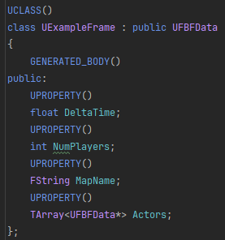

# What is this?
This plugin allows you to "record" frames, storing user defined data for each frame and replaying it later. Allowing far easier debugging in situations where breakpoints or printing isn't sufficient.
# Why would I want this?

[Blueprint](Blueprint.md)
# How to use
- Create the root frame where you can store any global variable you want to track (e.g deltatime) and an array of actor frames where you can store data about a specific actor in the scene.
## Create Root Frame
1. Create class inheriting from UFBFData
2. Create properties for the data you want to save
> All Properties must be marked as UPROPERTY()

> Supported types are FString, int, float, double, bool, FVector and FLinearColor

3. Inherit IFBFDebugActor on any singleton (Gamemode, PlayerController, etc)
4. Override IsRoot() and return true
4. Override GetDebugFrame() 
5. In GetDebugFrame() create an instance of your class and assign its properties and return it

6. Optional: Add an array of UFBFData* called Actors

## Create Actor
1. Create class inheriting from UFBFData
2. Add any other properties you want to track

### Required Properties 
    1. Position (FVector)
    2. Name (FString)
    (You can add the FBFHide meta tag to a property to hide it in the debug view)

### Optional Properties
    1. Extents (FVector). If not set, will just spawn with (1,1,1) scale
    2. MeshPath (FString). If not set, will spawn a generic cylinder
    Note: All Properties must be marked as UPROPERTY()
3. Inherit IFBFDebugActor on the actor you want to track 
4. Override GetDebugFrame()
5. Construct your UFBFData object, set its properties and return it.

## Navmesh
By adding a navmesh to the scene and setting 'Runtime Generation' to Dynamic the navmesh will automatically be saved and displayed in the debug scene.
    Note: Runtime Generation is set on the RecastNavmesh.
    Note: Can't save if the plugin path has a whitespace in it. (Can i remove the whitespace?)

## Reserved keywords
Some property names are in use by the plugin. Avoid using these when defining your own properties.
 // They aren't reserved. But the user may not define it with a different type
-- Don't inherit from interface in blueprint. Will cause crash. 

# TODO
1. Reserved keywords section
4. How to start / stop record
5. How to launch debug play
6. Find a better word for "debug Scene"
7. Add pics
8. Features list. Maybe it should just be in marketplace desc?